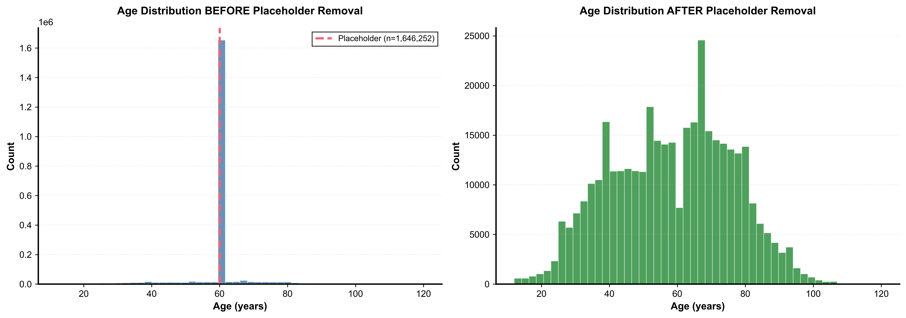
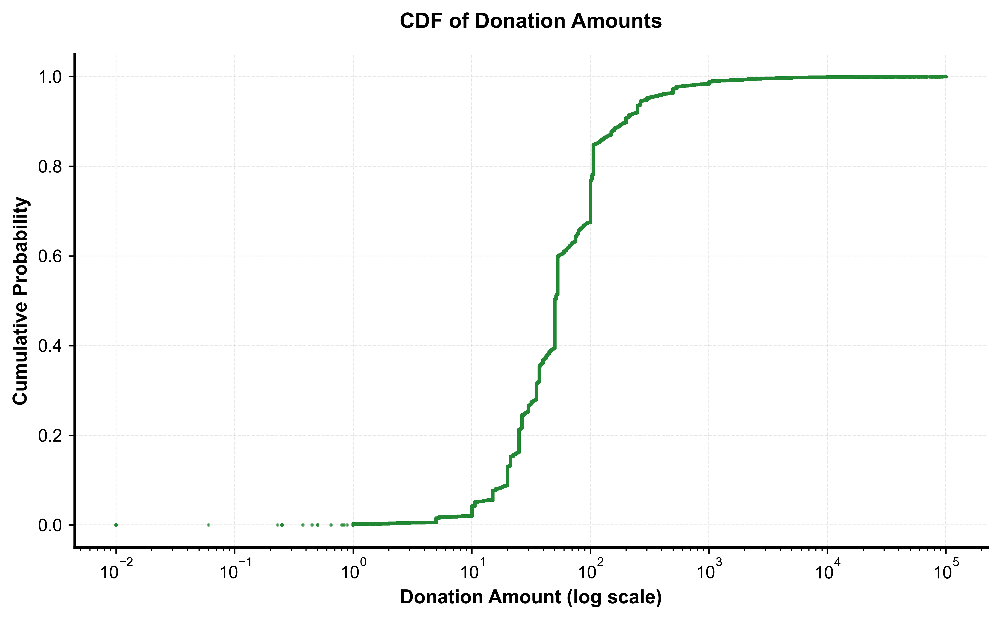
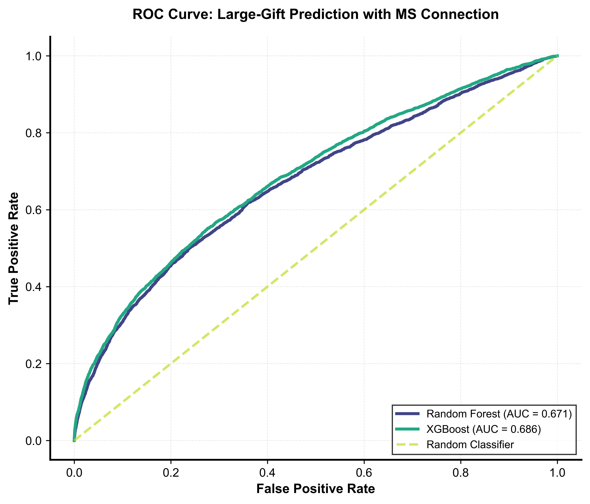
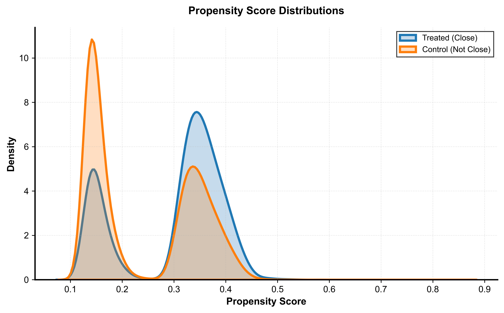
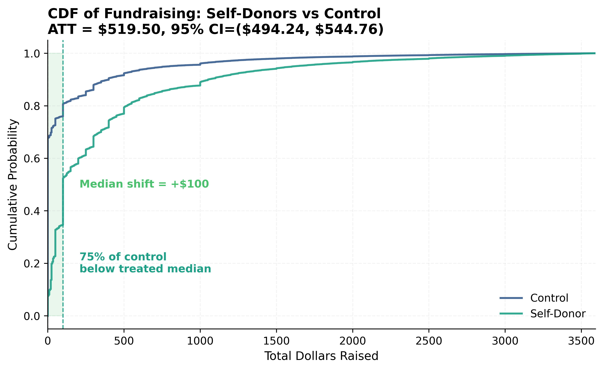
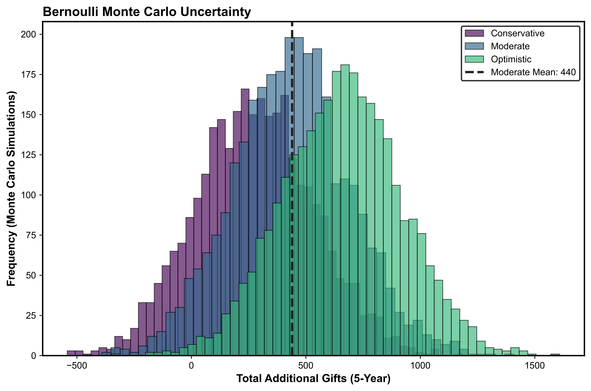
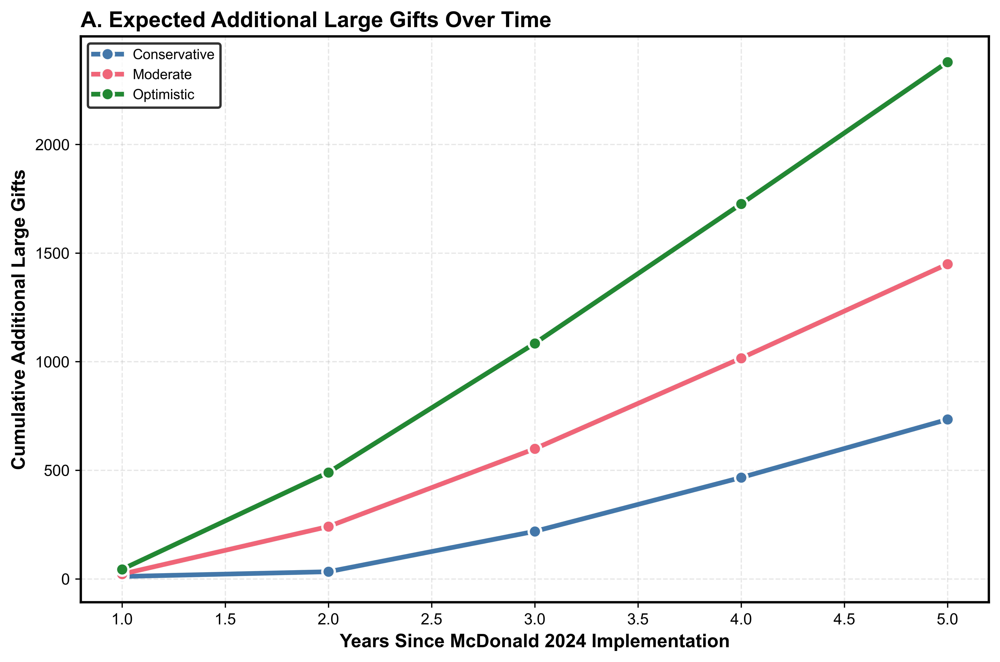
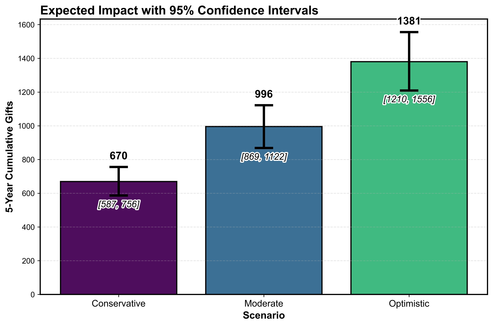

# Fundraising Analytics Visualization Portfolio

Data visualization portfolio demonstrating causal inference, predictive modeling, and uncertainty analysis using real-world data.

This repository presents visualizations from a causal inference and predictive modeling project. The focus is on communicating treatment effects, uncertainty, and outcome variability through clear, decision-oriented visuals.

---

## Key Strengths Demonstrated

- Communicating statistical results visually (confidence intervals, distributions, effects)
- Translating complex models into interpretable insights
- Visualizing uncertainty and scenario-based outcomes
- Working with real-world data challenges (missingness, data quality issues)

---

## Visualization Categories

---

## 1. Data Quality and Preprocessing

### Missing Data and Placeholder Detection

This visualization highlights a data quality issue caused by placeholder values, resulting in an artificial spike in the distribution. After removing placeholder values, the data reflects a more realistic population.

---

## 2. Distribution Analysis

### Outcome Distribution (CDF)

This cumulative distribution function (CDF) highlights the heavy-tailed nature of the data, where a small number of observations contribute disproportionately to total outcomes.

---

## 3. Model Evaluation

### ROC Curve

This ROC curve compares model performance for predicting key outcomes. The models demonstrate moderate discriminative ability based on AUC values.

---

## 4. Causal Inference

### Propensity Score Overlap

This plot shows overlap between treated and control groups after propensity score estimation, supporting valid causal comparisons.

### Treatment Effect (Matched Distribution)

This visualization compares outcome distributions between matched groups, illustrating the estimated treatment effect through a shift in distributions.

---

## 5. Simulation and Forecasting

### Monte Carlo Simulation

This simulation models uncertainty across multiple scenarios, showing variability in projected outcomes.

### Scenario-Based Forecasting

This plot shows projected cumulative outcomes over time under different scenarios.

### Confidence Interval Summary

This chart summarizes projected outcomes with confidence intervals, allowing comparison across scenarios.

---

## Summary

These visualizations demonstrate the ability to move from raw data to statistically grounded, decision-support insights using clear and interpretable visual design.
