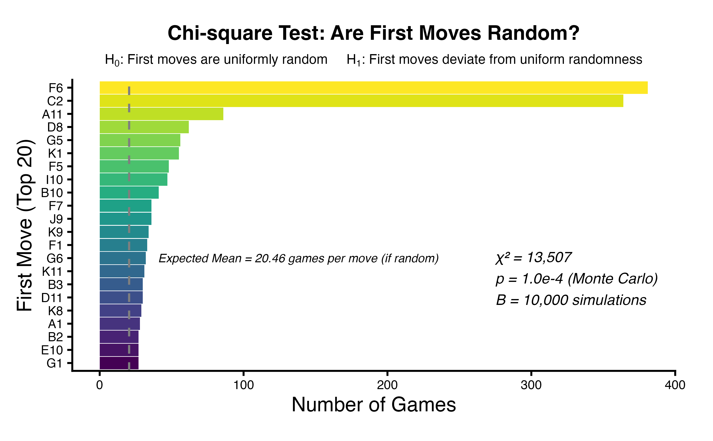
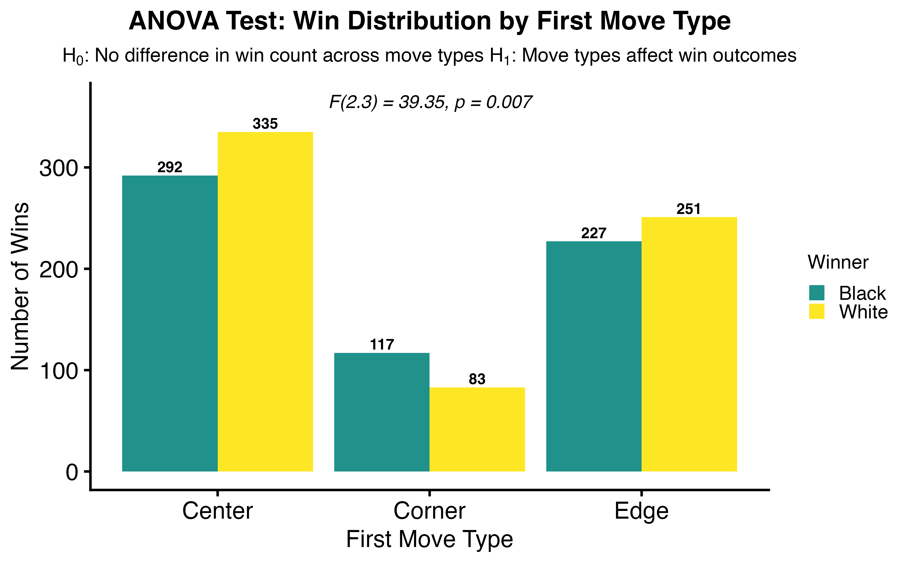

# Hex Game Analysis Visualizations

Statistical visualizations of 11x11 Hex games examining first move strategy, chain formation, and game outcomes.

## Key Findings
- First moves are not uniformly random (chi-square test)
- Center positions dominate early openings
- Top opening moves produce more near-unbroken chains
- Move type impacts both win outcomes and game length

## Example Visualizations

### First Move Distribution (Chi-square Test)

### Near-Unbroken Chains by Move Type (Proportion Test)

### Win Distribution by Move Type (ANOVA)

### Game Length by First Move (Density)

