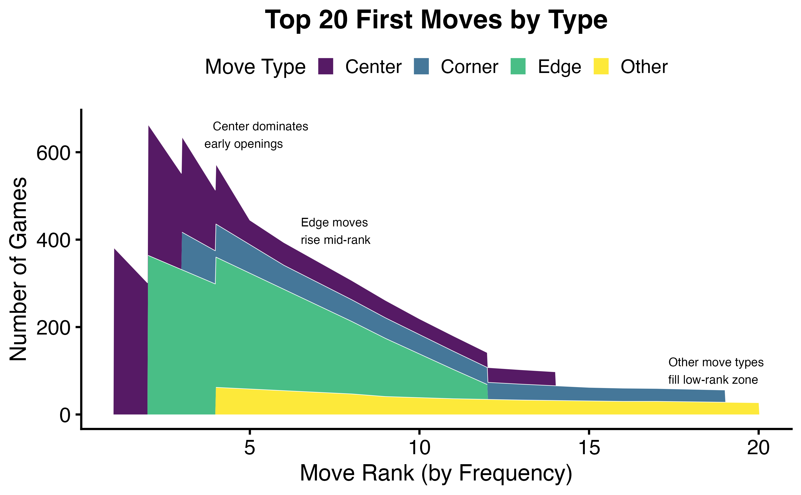
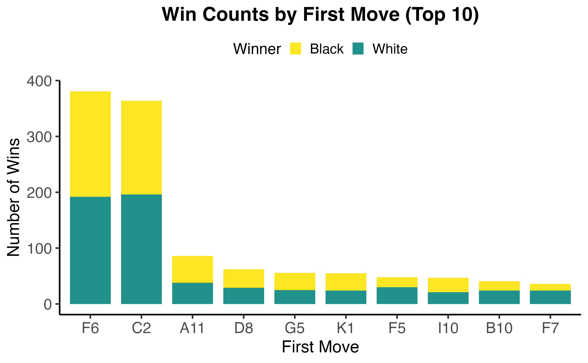
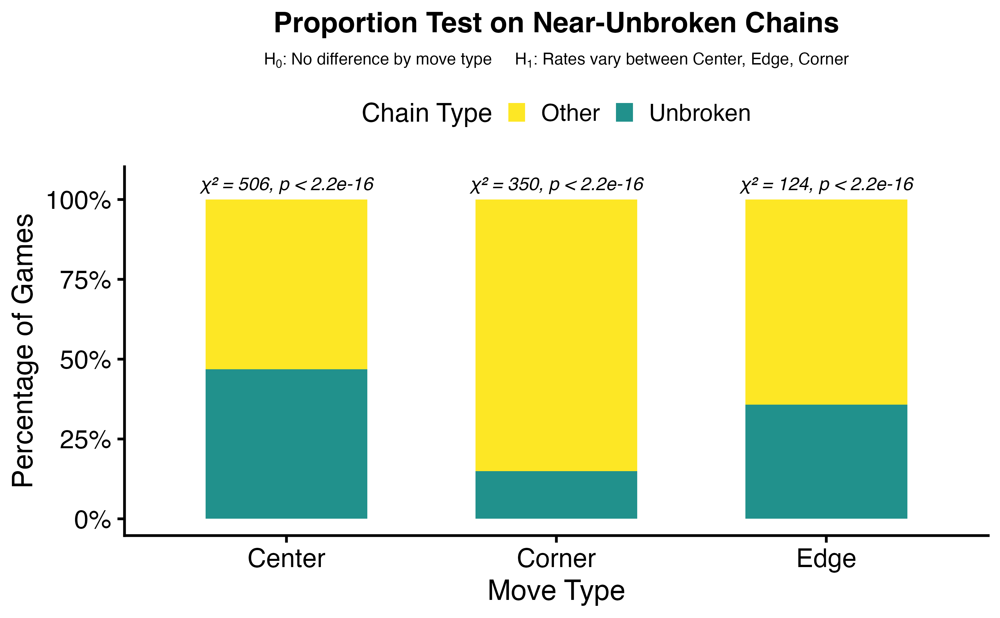
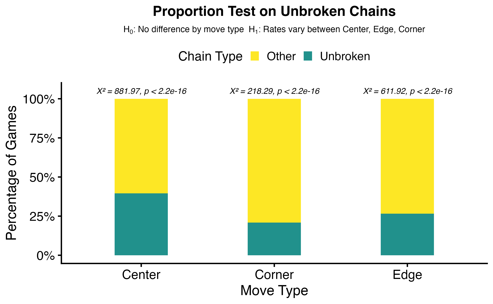
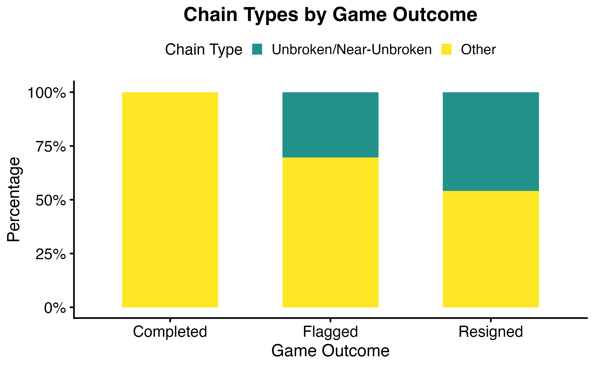
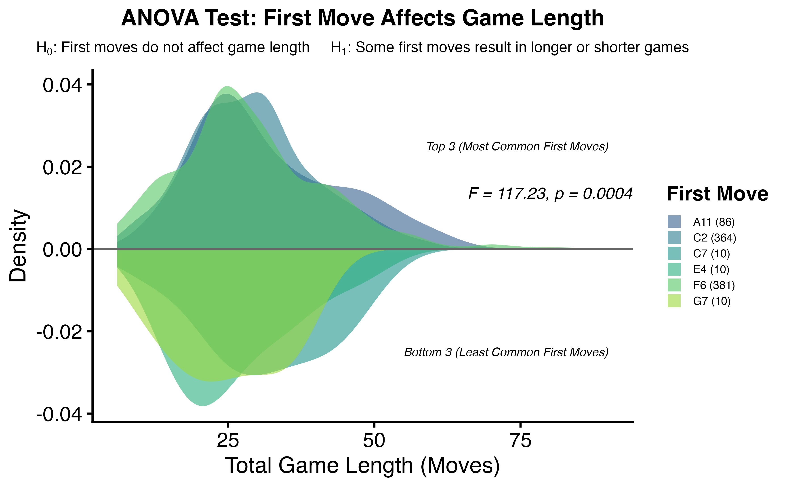

# Hex Game Analysis Visualizations

Statistical analysis and visualizations of 11x11 Hex games, focusing on first move strategy, chain formation, and game outcomes.

This project applies statistical testing and exploratory analysis to understand how early moves influence game structure and results.

---

## Key Findings

- First moves are not uniformly random (chi-square test)
- Center positions dominate early openings
- Certain opening moves are associated with higher win rates
- Near-unbroken and unbroken chain patterns differ by move type
- Move type impacts both win outcomes and game length

---

## Visualizations

---

### First Move Distribution (Chi-square Test)

This plot shows that first moves are not evenly distributed across the board, indicating strong player preferences.

---

### Top First Moves

The most frequent opening moves highlight strategic positioning patterns.

---

### Win Counts by First Move

This visualization compares how often specific first moves lead to wins.

---

### Win Distribution by Move Type (ANOVA)

This analysis evaluates whether move type significantly affects win outcomes.

---

### Near-Unbroken Chains (Proportion Test)

Certain move types are more likely to produce near-complete chains.

---

### Unbroken Chains by Move Type

This plot compares the likelihood of fully connected paths across move categories.

---

### Chain Type vs Outcome

This visualization connects chain formation patterns to game outcomes.

---

### Game Length by First Move (Density)

Game length varies depending on the opening move, suggesting strategic differences in play styles.

---

## Tools Used

- R (ggplot2, dplyr, statistical testing)
- Chi-square tests
- ANOVA
- Proportion tests

---

## Summary

This analysis demonstrates how early decisions in Hex influence both structural game patterns and outcomes, using statistical methods and visual analysis.
